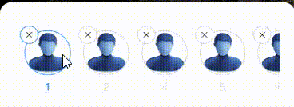

- A react native country code picker view with a modal, in typescript.

- It comes with a built-in TypeScript typings and is compatible with all popular JavaScript frameworks. You can use it directly or leverage well-maintained wrapper packages that allow for a more native integration with your frameworks of choice.

# Example:




## How to use:

```
import CountryCodePicker from 'rn-country-code-picker-modal';

    <CountryCodePicker
              onPickedCode={code => {
                setPhoneNumber(code);
              }}
            />
```

# CollapsingScroll Props -

| Name           | Type                    | Default |
| -------------- | ----------------------- | ------- |
| pickerStyle    | ViewStyle               |
| modalStyle     | ViewStyle;              |
| textStyle      | TextStyle;              |
| onPickedCode   | (code: string) => void; |
| filterBarColor | string;                 |
