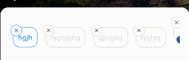
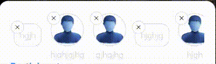

- A react native reusable component with 3 options: single select, multi select and deletable items with option to show image and text or just text, in typescript.

- It comes with a built-in TypeScript typings and is compatible with all popular JavaScript frameworks. You can use it directly or leverage well-maintained wrapper packages that allow for a more native integration with your frameworks of choice.

# Example:

## single select deletable with url


## single select deletable with url and without



## multi select deletable with url and without



## multi select with url and without


## How to use:

```
import HorizontalTabsSlider from 'rn-single-multi-deletable-select';

   <HorizontalTabsSlider
            isDeletable={false}
            isMultySelection={true}
            dataList={[
              { index: 0, name: 'hgjh' },
              {
                index: 1,
                name: 'hjghjgjhg',
                url: 'https://images.freeimages.com/365/images/previews/85b/psd-universal-blue-web-user-icon-53242.jpg',
              },
              { index: 2, name: 'gjhgjhg', url: 'https://images.freeimages.com/365/images/previews/85b/psd-universal-blue-web-user-icon-53242.jpg' },
              { index: 3, name: 'hjghjg' },
              { index: 4, name: 'hjgh', url: 'https://images.freeimages.com/365/images/previews/85b/psd-universal-blue-web-user-icon-53242.jpg' },
              { index: 5, name: 'hjghg', url: 'https://images.freeimages.com/365/images/previews/85b/psd-universal-blue-web-user-icon-53242.jpg' },
            ]}
          />
```

# ListItem Props -

| Name          | Type    | Default |
| ------------- | ------- | ------- |
| name          | string  |
| index: number |
| url           | string? |

# HorizontalSlider Props -

| Name               | Type                     | Default |
| ------------------ | ------------------------ | ------- |
| dataList           | ListItem[]               |
| isMultySelection   | ?boolean                 |
| onPressItem        | (item: ListItem) => void |
| onDeleteItem       | (item: ListItem) => void |
| isDeletable        | boolean                  |
| colorSelected      | string                   |
| colorUnSelected    | string                   |
| textStyle          | TextStyle                |
| itemContainerStyle | ViewStyle                |
| props              | FlatListProps            |
